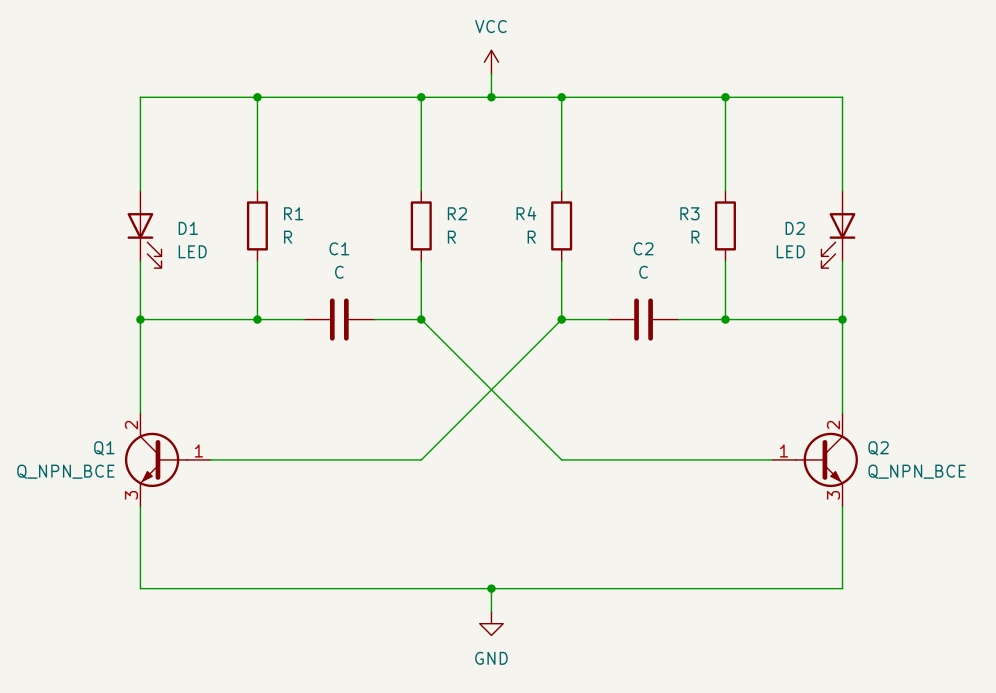

# Astable Multivibrator

## Concept

- **Name:** Astable Multivibrator  
- **Usage:** This circuit was invented around 1919 originally using triode vacuum tubes. The goal of this circuit was to generate a stable square wave clock for early radio/telegraphy. It is the extension of the monostable circuit.

## Architecture

## Theoretical Design

## Physical Design

## Testing
